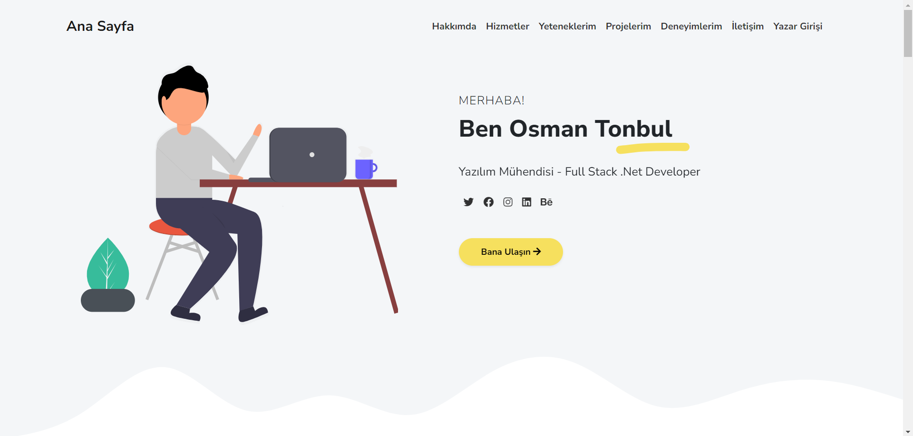
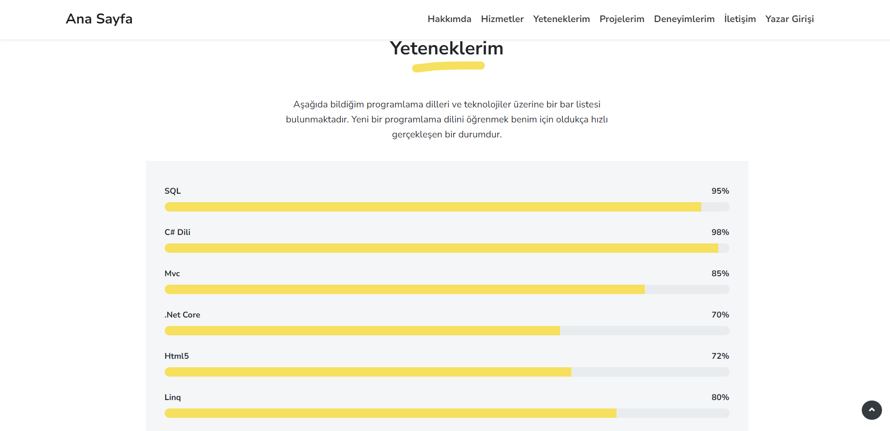
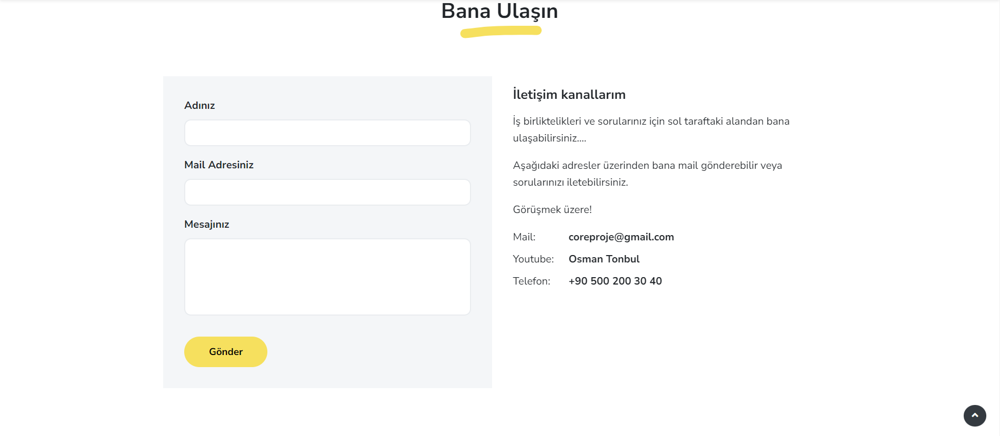
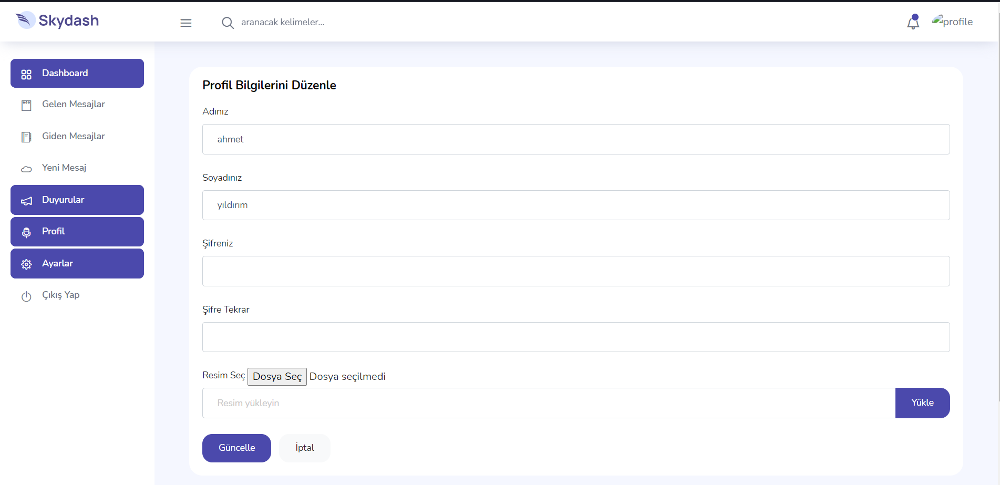
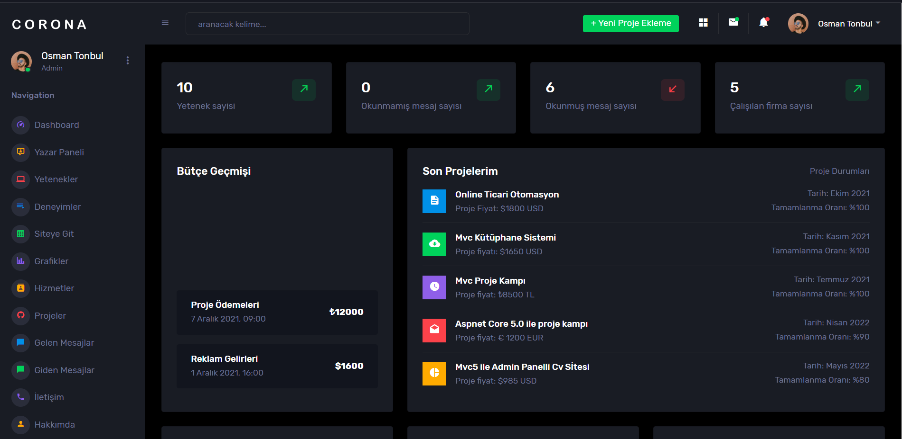
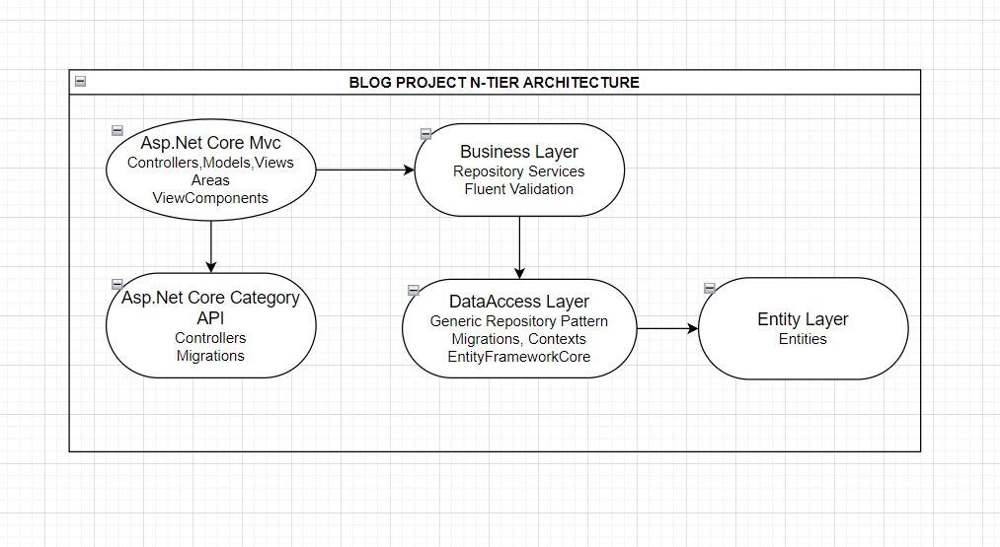

<h1>Blog Proje</h1>
<h3>1. Giriş</h3>

Geliştirilen blog projesi, kullanıcıların kişisel profil sayfalarında kendileri hakkında çeşitli bilgileri paylaştıkları, deneyimlerini, becerilerini ve ilgi alanlarını detaylı bir şekilde açıkladıkları; aynı zamanda diğer kullanıcılarla etkileşimde bulunarak fikir alışverişi yapabildikleri bir platformdur.

<h3>2. Kullanılan Teknolojiler</h3>
Asp.Net Core Mvc & Api, EntityFrameworkCore, FluentValidation, MSSQL, N Tier Architecture
 
<h3>3. Ekran Görüntüleri</h3>

Yazar kısmı:

Admin kısmı:

<h3>4. Projede Kullanılan Mimarinin Genel Hatları </h3>

<h3>5. Kurulum: </h3>
 - Projede DataAccessLayer -> Concrete -> Context.cs dosyasını açınız, UseSqlServer metodunda belirtilen veritabanı bağlantı dizesini kendi veritabanı bağlantı dizenize göre güncelleyiniz. 
 - Ardından Visual Studio aracının üst sekmesinden view -> other windows -> package manager console kısmına tıklayınız. 
 - Ardından açılan pencerede default project yazan yere tıklayıp açılan seçim ekranından DataAccessLayer katmanını seçiniz. 
 - Açılan pencereye "update-database" yazıp enter'a tıklayınız.(ilgili veritabanı ve tabloları SSMS'de oluşacaktır.) Bu adıma kadar olan kısımları Core_Proje_Api projesi için'de tekrarlayınız. 
 - Ardından Visual Studio aracının üst sekmesinden Project -> Configure startup projects yazan yere tıklayınız. Açılan pencereden "Multiple startup projects" seçeneğini seçiniz. Daha sonra karşınıza proje ile ilgili tüm katmanlar aktif bir şekilde çıkacaktır. Buradan Core_Proje ve Core_Proje_Api katmanlarının yanlarında bulunan seçim kutusuna tıklayarak start'a tıklayınız. Ardından uygula deyip tamam diyerek pencereyi kapatınız. 
 - Ardından start butonuna tıklayarak hem projeyi hemde api'yi ayağa kaldırınız.
